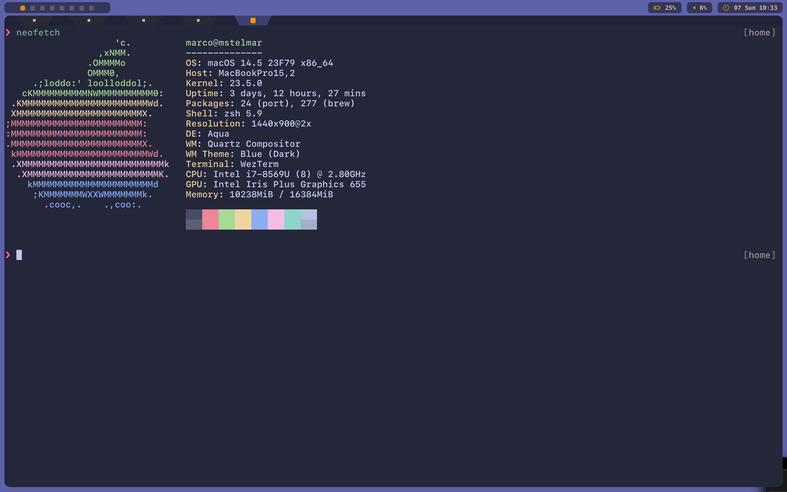

# dotfiles

Dotfiles using the following major technologies:

- zsh: <https://www.zsh.org>
- karabiner: <https://karabiner-elements.pqrs.org/>
- wezterm: <https://wezfurlong.org/wezterm/index.html>
- neovim: <https://neovim.io/>
- hammerspoon: <https://www.hammerspoon.org/>
- tmux: <https://github.com/tmux/tmux/wiki>
- aerospace: <https://github.com/nikitabobko/AeroSpace>
- sketchybar: <https://github.com/FelixKratz/SketchyBar>
- yabai (currently not using): <https://github.com/koekeishiya/yabai>
- kitty (currently not using): <https://sw.kovidgoyal.net/kitty/>
- uebersicht (currently not using): <https://github.com/felixhageloh/uebersicht>

# disclaimer

Dotfiles are very dependent on user taste. I'm making my (not up to date)
dotfiles available in case someone may benefit from them. There are actually
very nice customizations I have done/collected over the years and as I have some time
available and will descrive those here.

I also like to have a very clean look and feel. So here is a screenshot of my
desktop:

