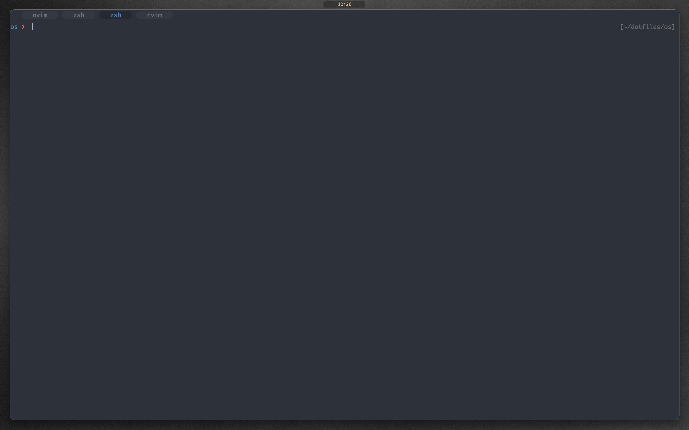
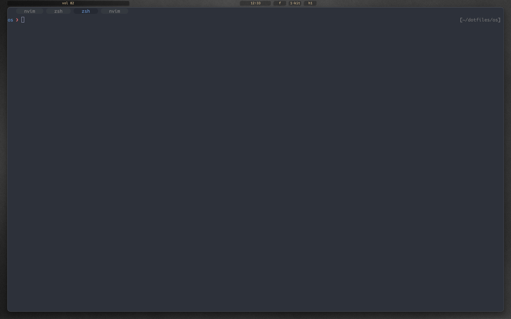

# dotfiles

Dotfiles using the following major technologies:

- zsh: https://www.zsh.org
- karabiner: https://karabiner-elements.pqrs.org/
- kitty: https://sw.kovidgoyal.net/kitty/
- wezterm: https://wezfurlong.org/wezterm/index.html
- yabai: https://github.com/koekeishiya/yabai
- neovim: https://neovim.io/
- hammerspoon: https://www.hammerspoon.org/
- tmux: https://github.com/tmux/tmux/wiki

# disclaimer

Dotfiles are very dependent on user taste. I'm making my (not up to date)
dotfiles available in case someone may benefit from them. There are actually
very nice customizations I have done/collected over the years and as I have some time
available and will descrive those here.

I also like to have a very clean look and feel. So here is a screenshot of my
desktop:

With shortcuts I can see some things in the topbar including battery, network,
current workspace and app. As all of these are distractions, I only see them
when needed (via shortcuts or automated rules).

